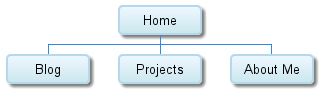

**What are the 6 Phases of Web Design?**

The 6 Phases of Web Design are:

1. Information Gathering
2. Planning
3. Design
4. Development
5. Testing and Delivery
6. Maintenance

**What is your site's primary goal or purpose? What kind of content will your site feature?**

The primary goal is to showcase my work. Content will include projects I've done, information about me, and a blog.

**What is your target audience's interests and how do you see your site addressing them?**

My target audience's interests are the projects that I've worked on. My site could address them by having certain projects featured on the home page.

**What is the primary "action" the user should take when coming to your site? Do you want them to search for information, contact you, or see your portfolio? It's ok to have several actions at once, or different actions for different kinds of visitors.**

The primary action the user should take is looking at work I've completed. If they are a potential employer I would also want them to be able to find my contact information.

**What are the main things someone should know about design and user experience?**

The main things someone should know about design and user experience are that you are designing with the end user in mind. You have to take into account your target audience and what they want to get out of the system you are designing.

**What is user experience design and why is it valuable?**

User experience design is designing for how a person feels using a system. It is valuable because a good user experience is what you are ultimately trying to achieve.

**Which parts of the challenge did you find tedious?**

I didn't find any of this challenge particularly tedious.