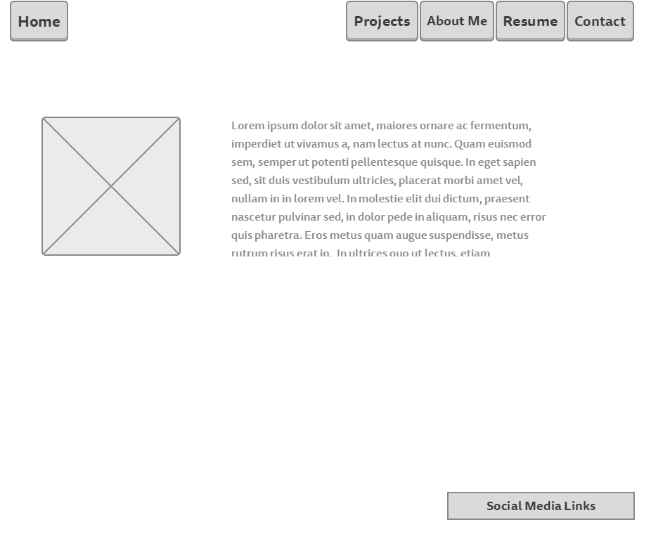

**What is a wireframe?**

A wireframe is an outline or blueprint for a web page.

**What are the benefits of wireframing?**

The benefits of wireframing are having something to work off of. Having a plan is better than having no plan.

**Did you enjoy wireframing your site?**

I didn't particularly like or dislike it. I feel like I need a better idea of what I should have on there.

**Did you revise your wireframe or stick with your first idea?**

I mostly stuck with my original idea. I don't quite know what my final website will need so I want to make only what I know will be on there.

**What questions did you ask during this challenge? What resources did you find to help you answer them?**

The only thing I wasn't clear on is how to actually make a wireframe. I had to search online for resources to make one.

**Which parts of the challenge did you enjoy and which parts did you find tedious?**

The only thing I found tedious was using the software I found to make the wireframe. Overall it wasn't very difficult.