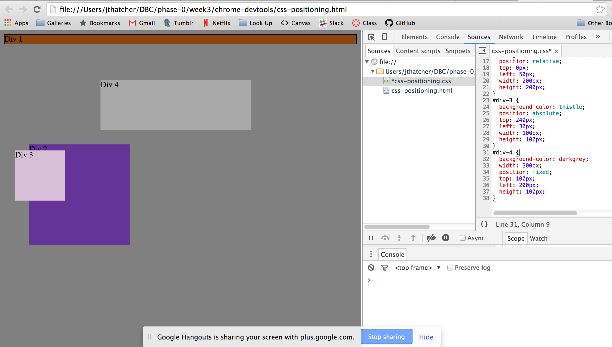
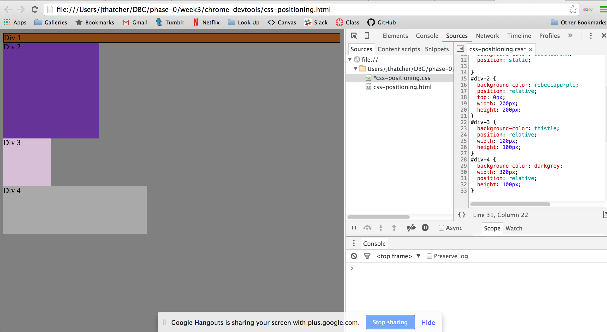
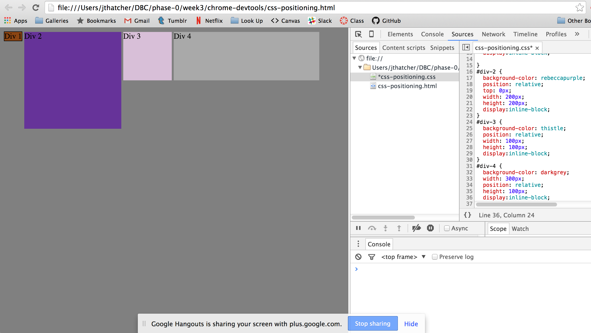
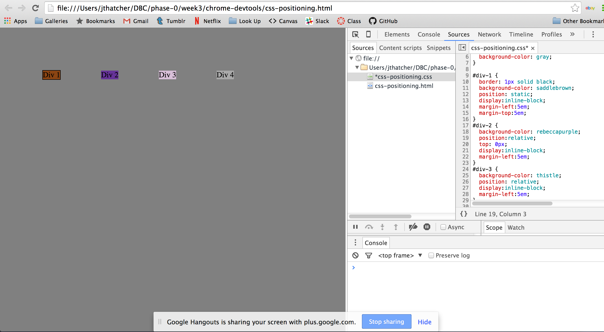
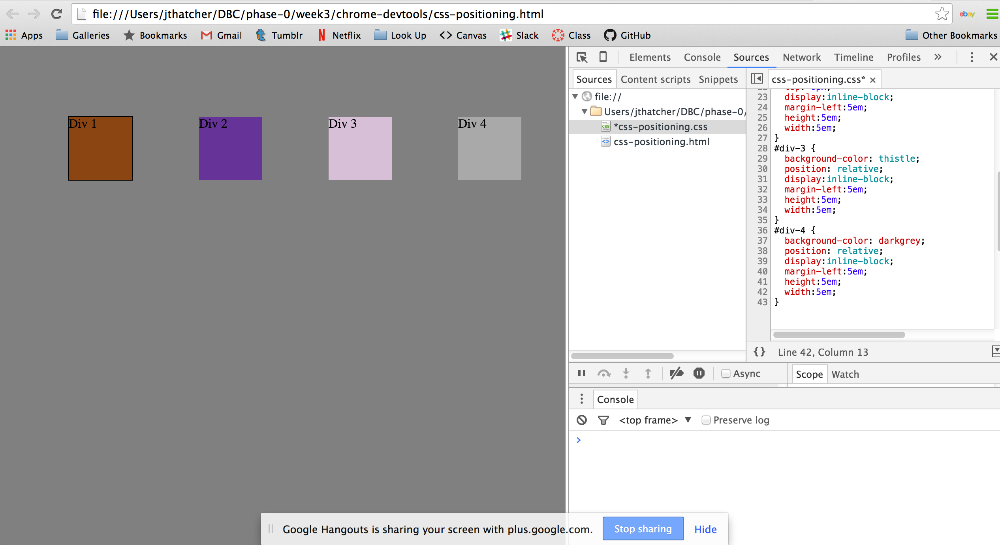
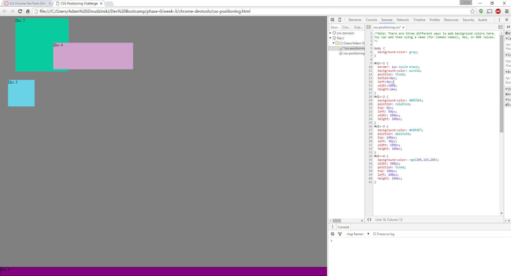
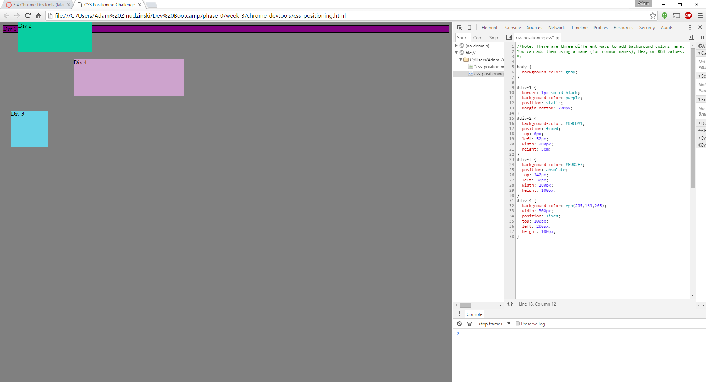
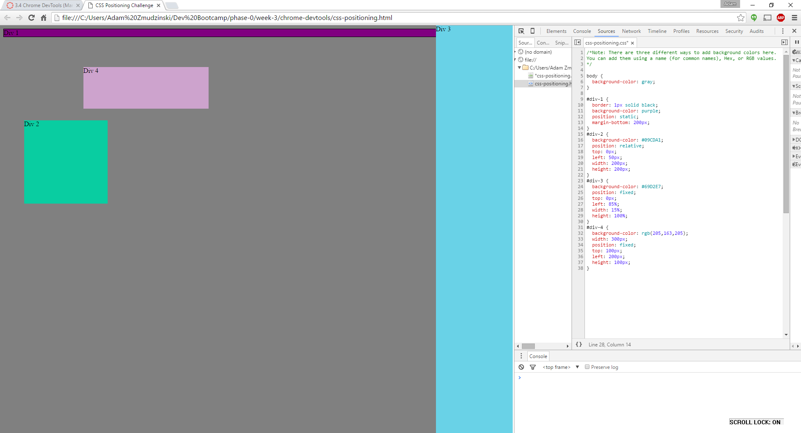
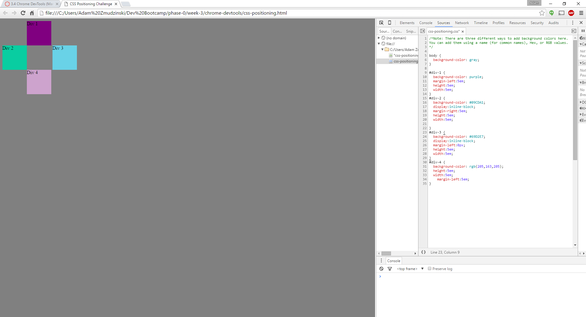

**Release 1:**

**Release 2:**

**Release 3:**

**Release 4:**

**Release 5:**

**Release 6:**

**Release 7:**

**Release 8:**

**Release 9:**

**How can you use Chrome's DevTools inspector to help you format or position elements?**

You can use it to see changes happen in real-time instead of refreshing a page.

**How can you resize elements on the DOM using CSS?**

One way of doing this would be to set the height and width properties.

**What are the differences between absolute, fixed, static, and relative positioning? Which did you find easiest to use? Which was most difficult?**

Absolute: Relative to its first non-static ancestor.
Fixed: Relative to the browser window.
Static (default): Relative to order in HTML.
Relative: Relative to its normal position.

**What are the differences between margin, border, and padding?**

Padding: A transparent layer around the content.
Border: A layer that wraps around the content and padding.
Margin: A transparent layer that wraps around the border, padding, and content.

**What was your impression of this challenge overall? (love, hate, and why?)**

I think this challenge was good practice of CSS positioning without being tedious.