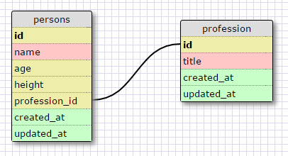
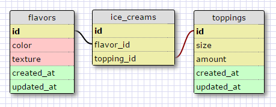
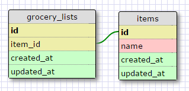

**What is a one-to-one database?**

	A one-to one database is two tables relate to each other in one way.

**When would you use a one-to-one database? (Think generally, not in terms of the example you created).**

	You would use a one-to-one database when two tables have a simgle relationship to each other.

**What is a many-to-many database?**

	A many-to-many database is a table that joins two or more tables.

**When would you use a many-to-many database? (Think generally, not in terms of the example you created).**

	You would use a many-to-many database when you have to join data together.

**What is confusing about database schemas? What makes sense?**

	The concept of databases makes sense to me. What is the most confusing is knowing how to structure one.